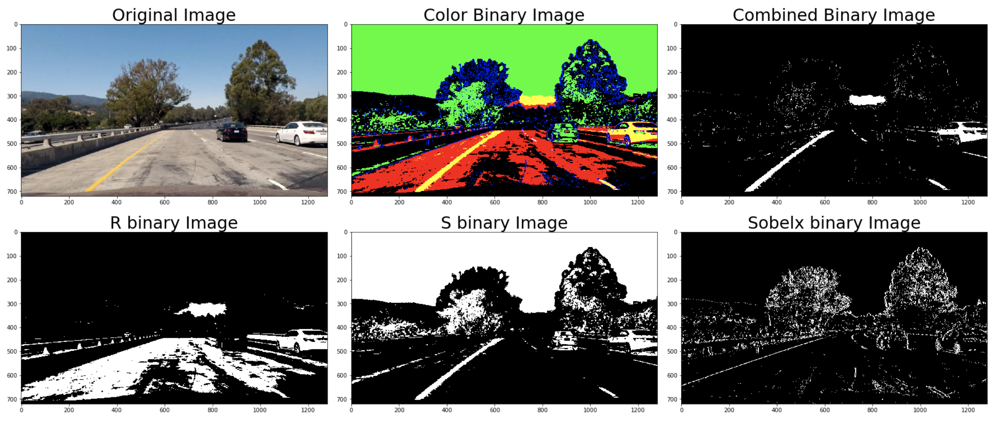
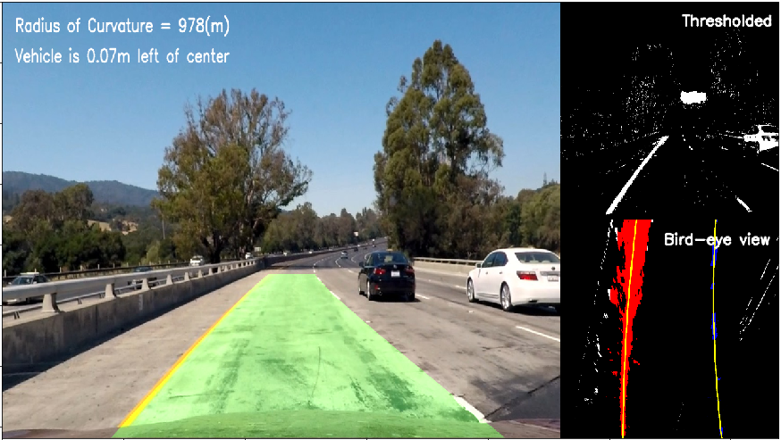

# **Advanced Lane Finding**

---

The goals / steps of this project are the following:
* Compute the camera calibration matrix and distortion coefficients given a set of chessboard images.
* Apply a distortion correction to raw images.
* Use color transforms, gradients, etc., to create a thresholded binary image.
* Apply a perspective transform to rectify binary image ("birds-eye view").
* Detect lane pixels and fit to find the lane boundary.
* Determine the curvature of the lane and vehicle position with respect to center.
* Warp the detected lane boundaries back onto the original image.
* Output visual display of the lane boundaries and numerical estimation of lane curvature and vehicle position.

---

### Reflection

#### Chessboard image

##### 1. Camera calibration and image undistortion
First, I prepared object points for all of images. Then for each image, I used `cv2.findChessboardCorners()` to find the chessboard corners. I visualized chessboard corners using `cv2.drawChessboardCorners()`. Here is the result:

Next, I used object points and image points I got previously to compute the camera calibration matrix and distortion coefficients using `cv2.calibrateCamera()`. Then I applied this istortion correction to the test image using `cv2.undistort()`. Here is the result:

#### Road image
Here I will describe the pipeline that I used for processing videos frame by frame.

##### 1. Image undistortion
First, I applied distortion correction to the images in the same way that I described previously in the chessboard part. Here is the result of one test image:

##### 2. Color transforms and gradients to create thresholded binary images
I used a combination of color and gradient thresholds to generate binary images. The combination is R channel in RGB color space, S channel in HLS color space, and x gradient using `cv2.Sobel()`. Here is the result of each thresholded method, three binary images stacked (color), and combined:

##### 3. Perspective transform
First, I prepared source points and destination points manually. Next, I computed perspective transform and inverse perspective transform using `cv2.getPerspectiveTransform()`. Then I warped images using `cv2.warpPerspective()` and the perspective transform to bird-eye view. Here is the result:

##### 4. Detect lane lines by sliding window
I first take a histogram along all the columns in the lower half of the image like this:

Using the histogram, I found the two peaks and used them as starting points for where to search for the lines. After the sliding window step, I got the pixel positions belonging to the lane lines and used them to fit a second order polynomial for left and right line. The visualization of the sliding windows step looks like this:

Once I found the lines, I don't need to do a blind search again. Instead, I can just search in a margin around the previous line position like this:

##### 5. Calculate the curvature of the lane and the offset of vehicle position from the center
I calculated the radius of curvature of the fit for each line using the formula and take the mean (during the calculation, I converted x and y values from pixel space to world space [m]).

##### 6. Unwarp and draw lane area
Finally I projected fit lines onto the original image using `cv2.warpPerspective()` and the inverse perspective transform. Here is the result:

I also output thresholded image and bird-eye view image for diagnosis. Here is the final result:

#### Video
Here are the results of two videos.

| Project video                                    | Challenge video                                  	          |
|:------------------------------------------------:|:------------------------------------------------------------:|
|||

#### Discussion

##### 1. Briefly discuss any problems/issues you faced in your implementation of this project. Where will your pipeline likely fail? What could you do to make it more robust?
I spent some time to tune threshold values or choose color spaces or gradient methods for creating a good binary image. But still it was quite difficult to find lane lines stably in some hard situations like in a shadow or where the road color or lighting condition is dramatically changing. So as Udacity recommended, I followed the following tips and tricks.
* **Tracking:**
To keep track of things like the best fitted lines (averaged over the last 5 detections) or x and y values for detected line pixels, it was useful to define a Line() class.
* **Smoothing and compensating:**
Using the Line() mentioned above, when the detection didn't seem good or I couldn't find lane lines (using sanity check mentioned later), I output the best fitted lines (averaged over the last 5 detections).
* **Sanity check:**
To check that the detection makes sense, I considered checking that the last lines and the detected lines are similar (meaning that the position or curvature didn't change dramatically).
* **Look-ahead filter and reset:**
As I described before, once I found the lines, I can just search within a window around the previous detection. But if the sanity check says it's a bad detection, I start searching from scratch using a histogram and sliding window.
